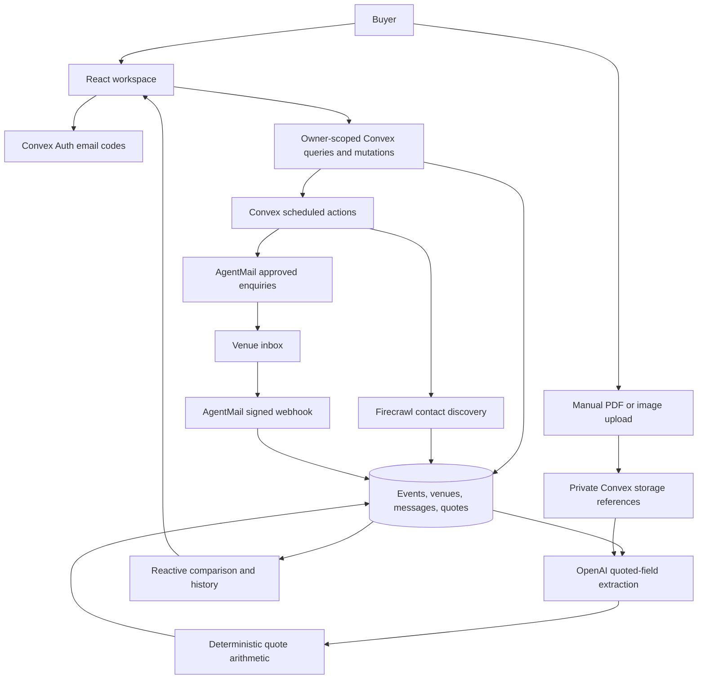

# How One Table works

Owner checks protect event access. Convex rate limits bound search, extraction, upload and mail requests. Discovery produces leads, not verified availability or price promises. Sending needs buyer approval; one optional clarification may follow. The model extracts terms; it never calculates totals.

API keys and webhook signing secrets stay on the backend. Original documents reach OpenAI for extraction. Fictional examples require no outbound mail.
